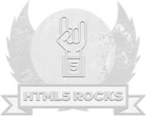

# Hello HTML

## Objetivo

Comenzar a escribir un documento HTML5 válido e ir haciéndose con el uso de las diferentes etiquetas.

## Instrucciones

Crea una carpeta con el nombre hello-html en tu carpeta de alumno y realiza las tareas de los siguientes objetivos.

## Objetivo 1

Crea una página HTML5 que cumpla lo siguiente:

- Ser un documento válido HTML5
- El título visible en el navegador debe ser "Mi primera página en HTML5"
- Especificar el idioma de la página a "es"
- La codificación de caracteres es UTF-8
- Debe permitir la indexación por parte de buscadores y el seguimiento de enlaces pero no su archivado en caché
- Contiene meta etiquetas para el indexado de buscadores (descripción y palabras claves)
- No debe permitir el escalado del contenido
- Debe tener un título de página en el body que coincida con el título de página.

## Objetivo 2

Sobre el contenido visible de la página:

- Incluir un subtítulo justo a continuación del título principal ya existente que diga "fundamentos básicos"
- Tener dos párrafos diferentes (generados con [limsum](https://www.lipsum.com/))
- Agregar varias palabras o frases en negrita y/o cursivas
- Después de los párrafos debe estar la siguiente imagen

- Los párrafos anteriores tendrán también una imagen entre ellos obtenida desde [picsum](https://picsum.photos/)
_ La imagen anterior debe enlazar con **https://google.es**

## Objetivo 3

- Incluir una lista desordenada con 5 elementos de la tabla periódica (los que más coraje te den)
- Incluir una lista ordenada con 5 elementos con tareas a realizar en el orden en el que las harías
- Incluir una tercera lista con enlaces a las siguientes páginas:

    - https://google.es
    - https://microsoft.com
    - https://hotmail.es

## Objetivo 4

- Crea la estructura HTML de la siguiente tabla

[Back](../readme.md)